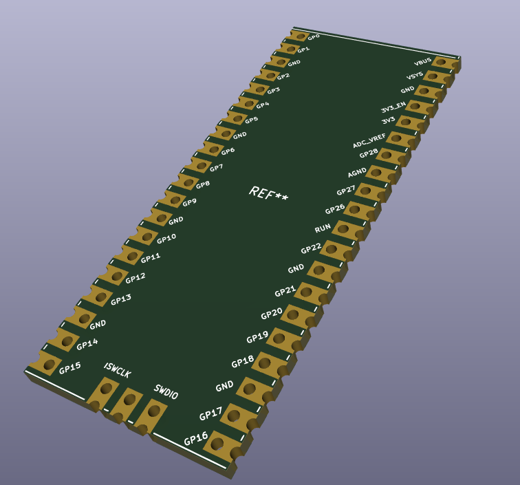
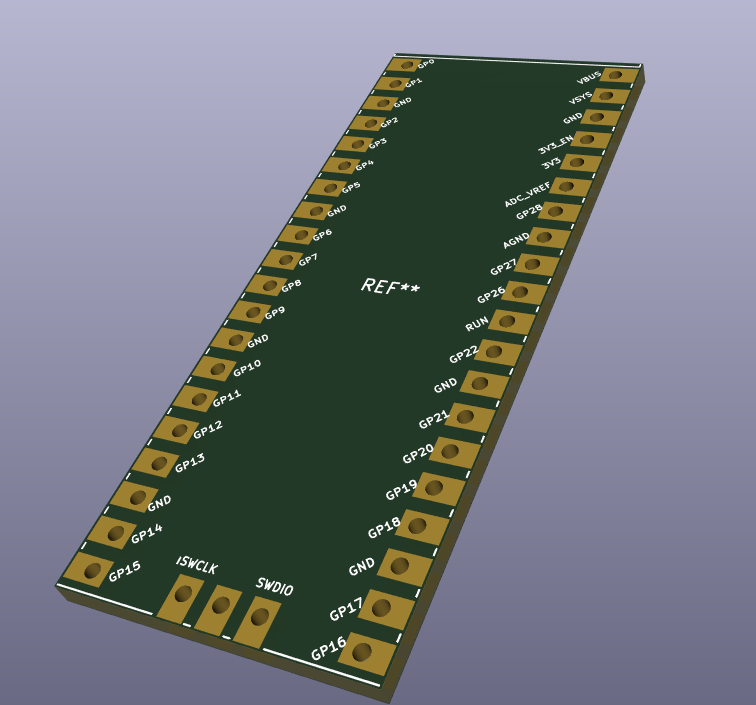

# Raspberry Pico development board footprints

Modified from [here](https://github.com/ncarandini/KiCad-RP-Pico), and thus also under TPCWare KiCaD Licence (see License file).

The original library allows for integration of the Raspberry Pico boards (all 4 variations) onto PCB designs by soldering to the castellations or through-hole pins.

The modified library here aims to reproduce the development board form factor itself (including pin labels, silk screen, etc.) to create variants of the development board:

Board with castellation. Great for soldering directly to other PCBs, but not necessarily easy to get produced with cost-effective PCB services.

Board with through-hole connections only, should be easy and cheap to produce by any PCB service. 

